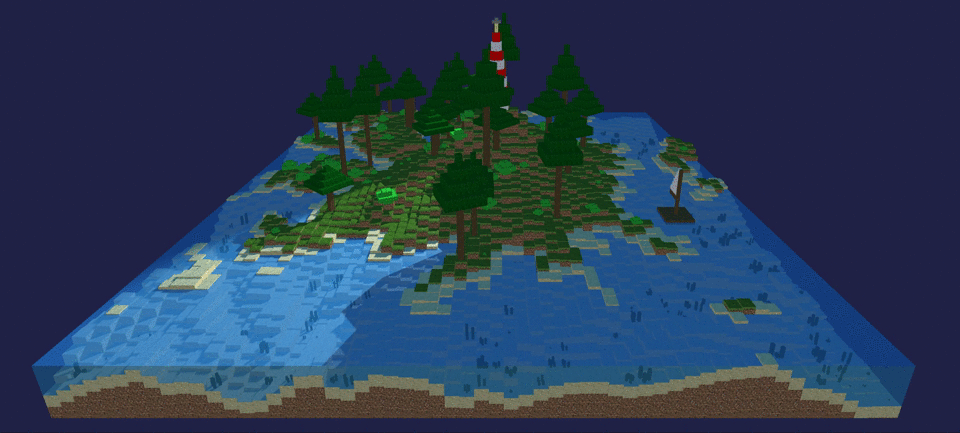

# Relazione primo progetto Interactive 3D Graphics

## Descrizione
Come si può notare dall'immagine la scena rappresenta un'ambientazione marina, con un faro in funzione di notte. Le animazioni implementate sono il movimento della luce del faro e quello della zattera, che si avvicina e si allontana dalla riva, simulando l'idea dello spostamento dovuto alla corrente.

Tutto il codice necessario è presente nel file [final_project.html](final_project.html).
I file ultizzati per le texture dei cubi sono salvati nella cartella [textures](textures).
L'HeightMap di partenza si trova nella cartella [heightmaps](heightmaps) ed è la segunte

## Strumenti utilizzati
- Hardware:
  - CPU: 2,3 GHz Intel Core i5 quad-core
  - Scheda grafica: Intel Iris Plus Graphics 655 1536 MB
- Software:
  - Git
  - Atom
  - Google Chrome
  - Safari

## Realizzazione
Ogni Mesh è stata realizzata manualmente tramite l'editor Atom. In particolare, ogni punto spiegato nel [diario](journal.md) è stato implementato in una diversa cartella nella repository git su un branch diverso dal master (chiamato dev) prima del commit finale che prevede il merge con il master.

## Funzionamento
Il ragionamento con cui è stato implementato il codice si basa sul risultato ottenuto dalla funzione getHeightData fornita in partenza: scorrendo l'array si può disegnare un tipo di terreno diverso e aggiungere la vegetazione appropriata con una determinata probabilità.

Il faro è stato generato nel punto di altezza massima, mentre la zattera è stata aggiuinta in un punto specifico.
La velocità di movimento dell'animazione della luce del faro dipende dalla velocità di render della pagina, mentre quella della zattera è legata ad un determinato intervallo di tempo.
La vegetazione viene generata con una certa probabilità e cambia a seconda della posizione. Inoltre, le dimensioni e la rotazione sull'asse y di ciascun elemento della vegetazione dipendono da un valore casuale generato ad ogni chiamata della rispettiva funzione.

## Ottimizzazione
Si è cercato di ottimizzare l'efficienza del codice provando a dimunire il numero delle facce dei cubi generati, in particolare:
- vengono rimosse le facce non necessarie nel perimetro del terreno;
- nei punti interni del terreno vengono sempre generati:
  - un cubo all'altezza corretta senza la faccia inferiore,
  - la faccia inferiore di un cubo nel punto più basso,
  - e:
    - la faccia superiore dell'acqua alla giusta altezza, se il punto si trova al di sotto del livello del mare;
    - le facce laterali di un cubo sottostante, se il punto si trova al di sopra del livello del mare per evitare "buchi".

Similmente, l'ottimizzazione viene fornita anche per la vegetazione, il faro e la zattera rimuovendo tutte le facce non necessarie.

Nonostante questi accorgimenti, il codice risulta comunque abbastanza lento. Tuttavia, la causa non può essere attribuita solo al numero di facce generate, ma anche alle ombre sul terreno create dalla luce del faro.
