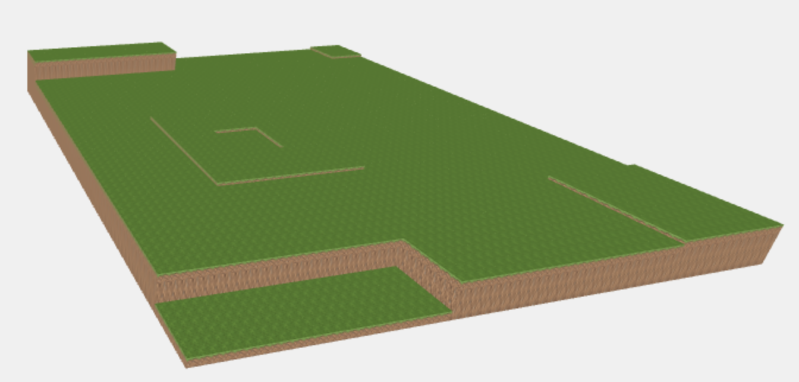
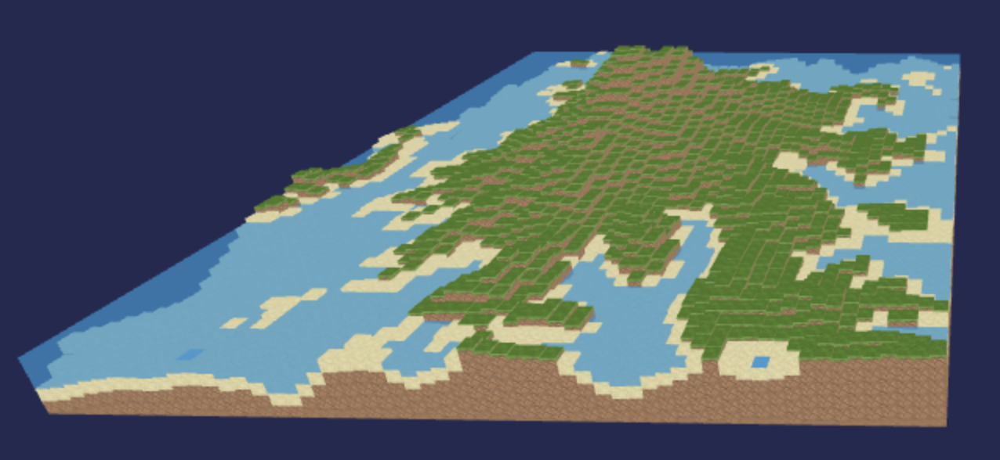
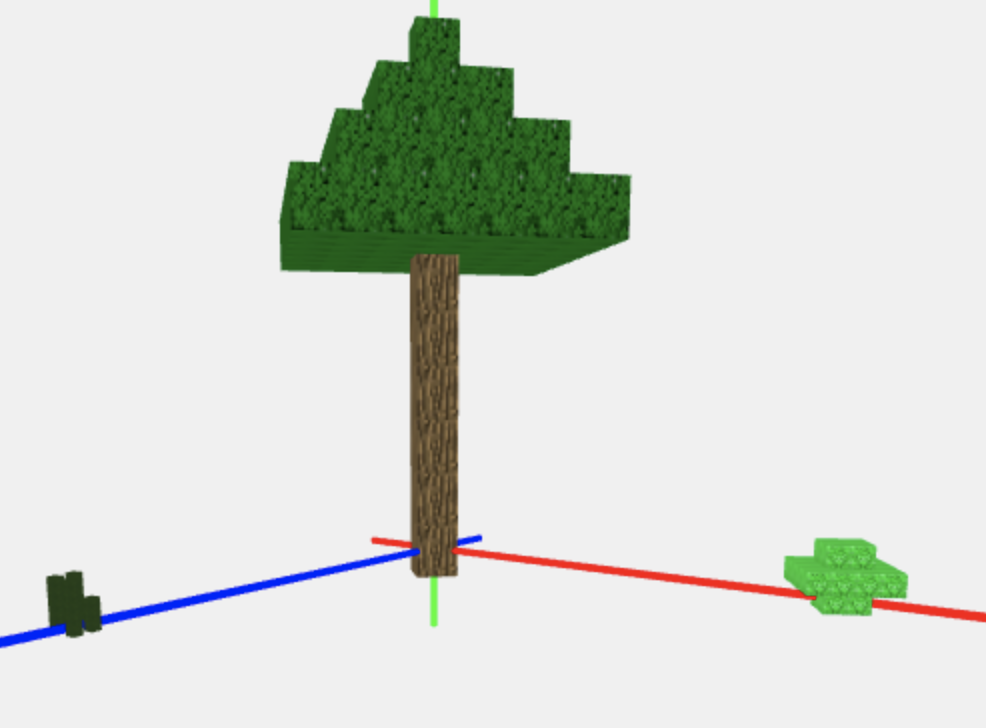
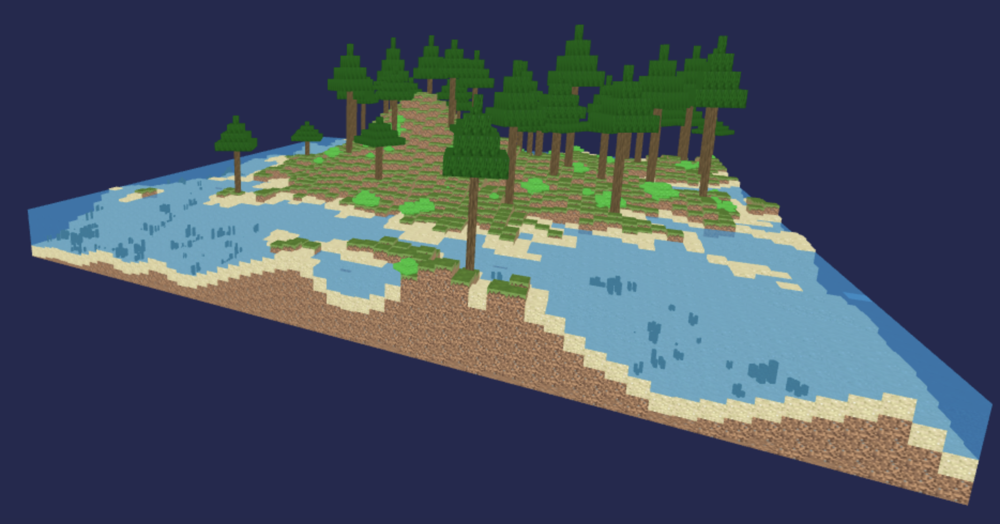
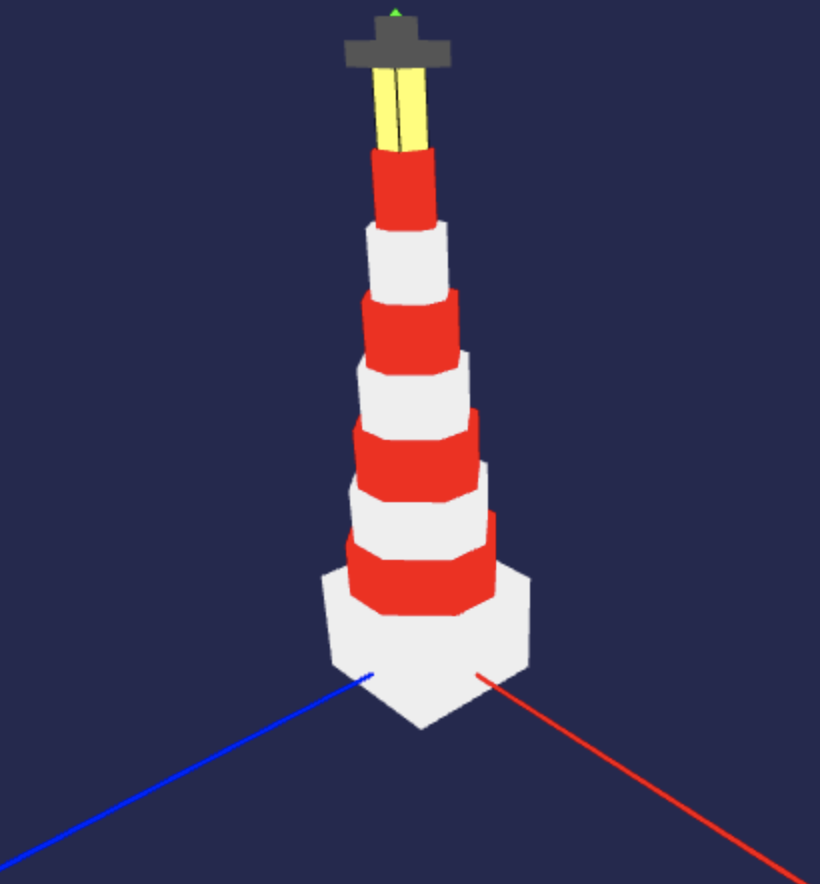
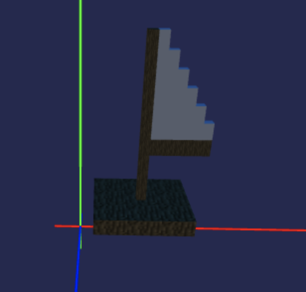

# Diario del primo Progetto di Interactive 3D Graphics

La scena scelta da rappresentare prevedeva un faro in funzione sul mare di notte.
Il progetto è stato diviso nelle seguenti fasi:

1. Verifica delle funzioni del codice di partenza
    - Conclusione dell'implementazione della funzione che disegna il terreno
    - Accenni di ottimizzazione

2. Creazione delle Mesh vegetazione
    - Alberi
    - Cespugli
    - Alghe

3. Studio e implementazione della luce del faro in movimento
    - HemisphereLight
    - Spotlight + Target

4. Creazione della Mesh che compone il faro

5. Unione in un solo file del terreno con vegetazione, faro e luce in movimento

6. Aggiunta della zattera animata

7. Conclusione
    - Stesura del diario e della relazione
    - Bug Fixing, refactor e ottimizzazione

## Verifica delle funzioni del codice di partenza

Per prima cosa si è scelto di verificare le funzioni di partenza e provare ad implementare la funzione che disegna il terreno a partire dall'output della funzione getHeightData.

Successivamente si è  scelta una  diversa sorgete heightmap che risulterà poi la base della scena del progetto, compresa di livello dell'acqua (trasparente per poter vedere il fondale) e riducendo il costo della complessità disegnando solo i cubi necessari ed eliminando le facce non necessarie con la funzione splice() sugli array geometry.faces dei cubi.

## Creazione delle Mesh vegetazione
In questa fase sono state implementate le funzioni che creano alberi, cespugli e alghe.

Ed è stata aggiornato il terreno con le piante.

## Studio e implementazione della luce del faro in movimento

Per poter riuscire a rappresentare la scena in una ambientazione notturna, si è scelto di illuminarla con una HemisphereLight tenue e di rappresentare invece la luce del faro con una  Spotlight che segue un Target in movimento.

## Creazione della Mesh che compone il faro

Il faro è una Mesh costituita da una base, un corpo di ottagoni che diminuiscono di dimensione all'aumento del livello, e dalla cima con luce. Anche per questa Mesh sono state eliminate tutte le facce non necessarie.

## Unione in un solo file del terreno con vegetazione, faro e luce in movimento

In questa fase si è fatto il merge del terreno con la vegetazione e del faro con le informazioni sull'illuminazione ambientale e  della luce del faro in movimento.

## Aggiunta della zattera animata
Si è deciso di aggiungere un altro dettaglio, una zattera spostata leggermente avanti e indietro dalla corrente, quindi prima è stata creata la Mesh.

Viene infine aggiunta alla scena ottenuta dal merge con la sua animazione.

## Conclusione
Nella fase finale si è completata la stesura del diario e della relazione, oltre al refactor del codice e a qualche tentativo di rimuovere avvisi ed errori che compaiono nella console del browser.
In particolare sono stati risolti:
- gli avvisi relativi alla modifica forzata delle dimensioni delle texture modificando le immagini di partenza tramite un software di manipolazione delle immagini;
- gli errori provenienti dalla riga "controls.addEventListener( 'change', Render );" rimuovendola dato che in questa scena non sono necessari input provenienti dall'utente e lasciando solo libertà di seguire.

Non sono stati risolti invece gli avvisi forniti da Google Chrome riguardanti il fatto che l'handler della funzione "requestAnimationFrame" ci impieghi troppo tempo.
