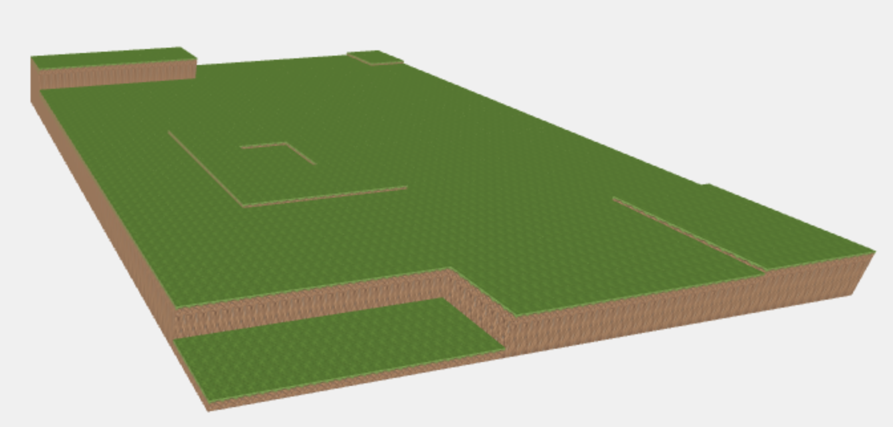
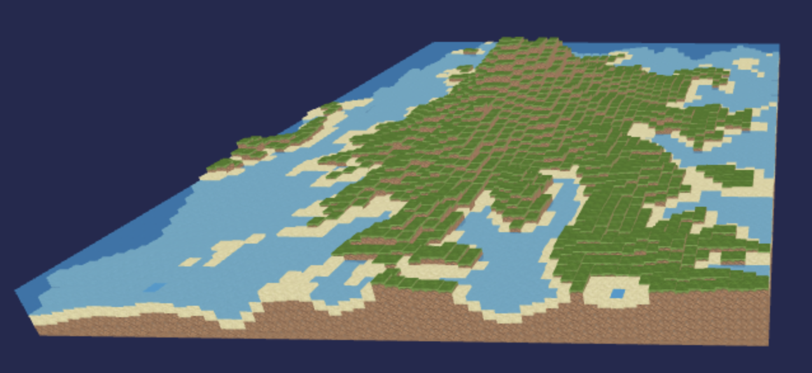
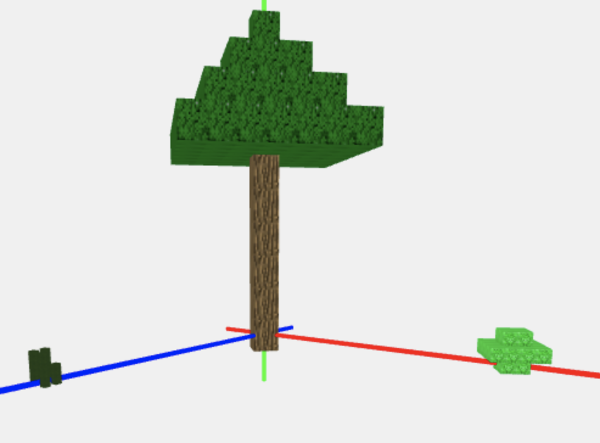
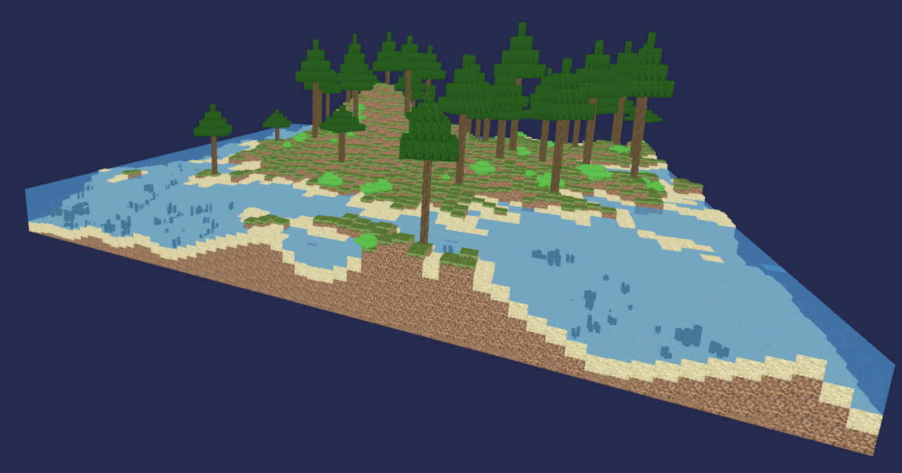
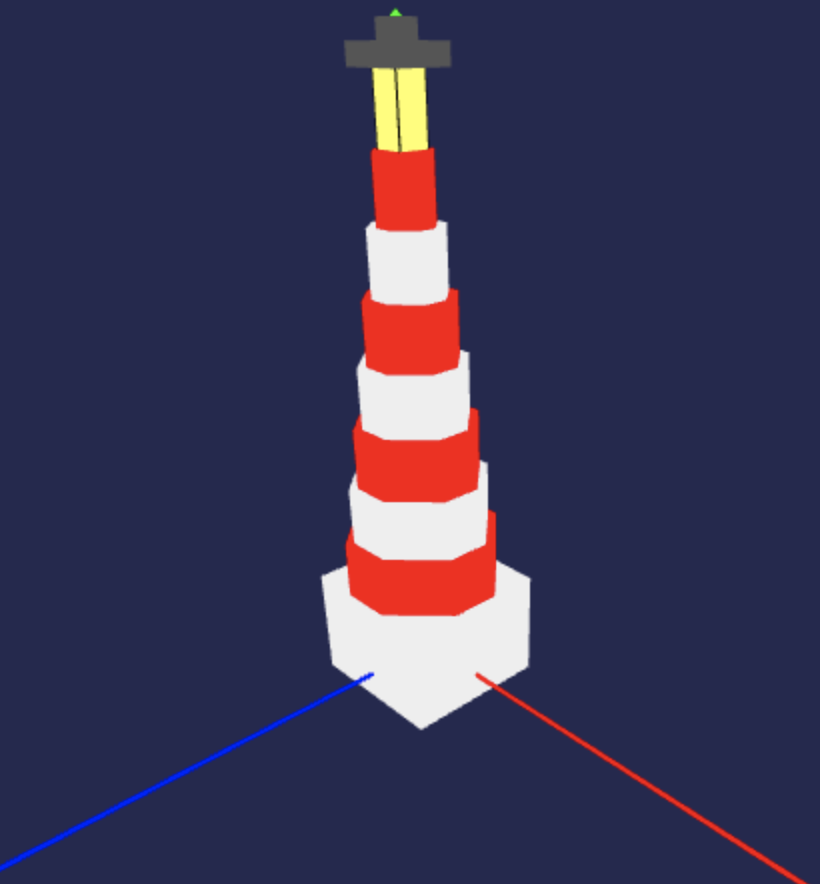
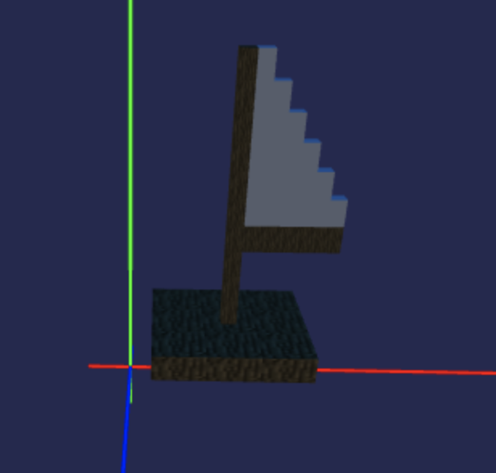

# Diario del primo Progetto di Interactive 3D Graphics

La scena scelta da rappresentare prevedeva un faro in funzione sul mare di notte.
Il progetto è stato diviso nelle seguenti fasi:

1. **Verifica delle funzioni del codice di partenza**
    - Conclusione dell'implementazione della funzione che disegna il terreno
    - Accenni di ottimizzazione

2. **Creazione delle Mesh vegetazione**
    - Alberi
    - Cespugli
    - Alghe

3. **Studio e implementazione della luce del faro in movimento**
    - HemisphereLight
    - Spotlight + Target

4. **Creazione della Mesh che compone il faro**

5. **Unione in un solo file del terreno con vegetazione, faro e luce in movimento**

6. **Aggiunta della zattera animata**

7. **Conclusione**
    - Stesura del diario e della relazione
    - Bug Fixing, refactor e ottimizzazione

## Verifica delle funzioni del codice di partenza

Per prima cosa si è scelto di verificare le funzioni di partenza e provare ad implementare la funzione che disegna il terreno a partire dall'output della funzione getHeightData.

Successivamente è stata scelta una diversa heightmap sorgente, che risulterà poi essere la base della scena del progetto, compresa del livello dell'acqua resa trasparente per permettere di visualizzare il fondale. È stato ridotto il costo della complessità disegnando solo i cubi necessari ed eliminando le facce non essenziali con la funzione splice() sugli array geometry.faces dei cubi.

## Creazione delle Mesh vegetazione
In questa fase sono state implementate le funzioni che creano alberi, cespugli e alghe.

È stato poi aggiornato il terreno con l'aggiunta delle piante.

## Studio e implementazione della luce del faro in movimento

Per poter riuscire a rappresentare la scena in una ambientazione notturna, si è scelto di illuminarla con una HemisphereLight tenue e di rappresentare, invece, la luce del faro con una  Spotlight che segue un Target in movimento.

## Creazione della Mesh che compone il faro

Il faro è una Mesh costituita da una base quadrata, un corpo di ottagoni che diminuiscono di dimensione all'aumento del livello, e dalla cima con luce. Anche per questa Mesh sono state eliminate tutte le facce non necessarie.

## Unione in un solo file del terreno con vegetazione, faro e luce in movimento

In questa fase è stato fatto il merge del terreno con la vegetazione, del faro con le informazioni sull'illuminazione ambientale e della luce del faro in movimento.

## Aggiunta della zattera animata
Si è deciso di aggiungere un altro dettaglio: una zattera che viene spostata leggermente avanti e indietro dalla corrente. Perciò, prima è stata creata la Mesh della zattera.

Infine, questa viene inserita nella scena ottenuta precedentemente dal merge, e viene aggiunta la sua animazione.

## Conclusione
Nella fase finale è stata completata la stesura del diario e della relazione, oltre al refactor del codice e a qualche tentativo di rimuovere avvisi ed errori che compaiono nella console del browser.
In particolare sono stati risolti:
- gli avvisi relativi alla modifica forzata delle dimensioni delle texture modificando le immagini di partenza tramite un software di manipolazione delle immagini;
- gli errori provenienti dalla riga "controls.addEventListener( 'change', Render );", rimuovendola, dato che in questa scena non sono necessari input provenienti dall'utente e lasciando solo la libertà di cambiare la posizione della camera.

Non sono stati risolti, invece, gli avvisi forniti da Google Chrome riguardanti il fatto che l'handler della funzione "requestAnimationFrame" ci impieghi troppo tempo.
